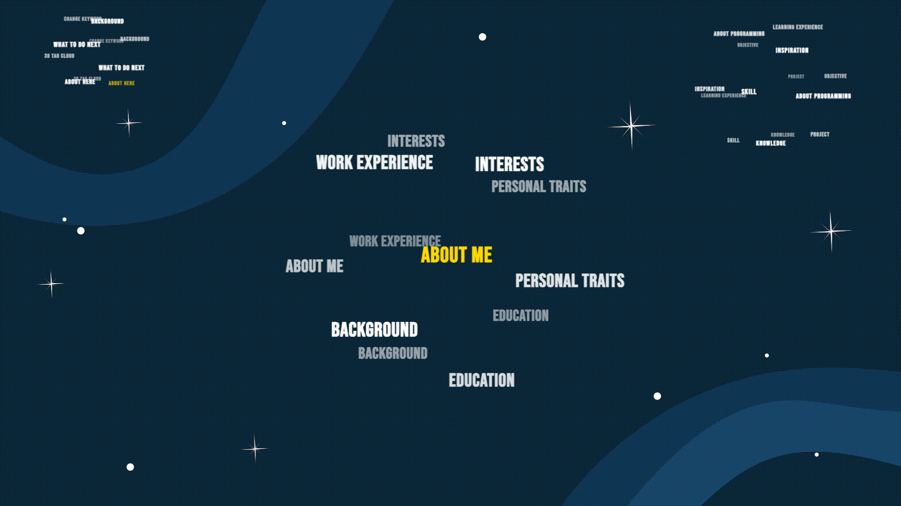
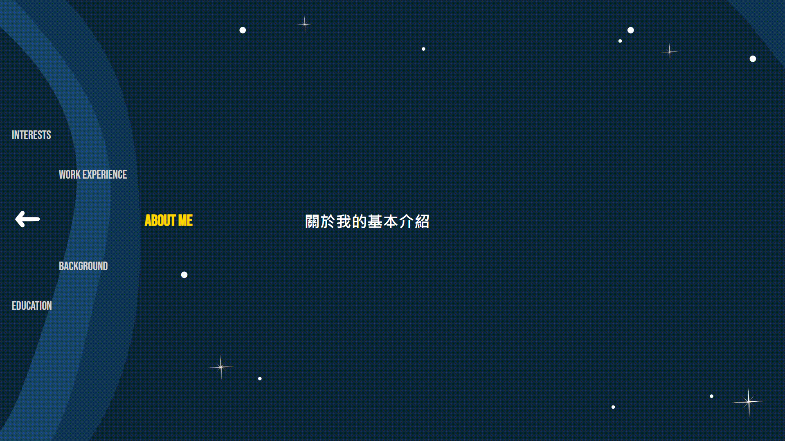

# 動態問卷

## 使用工具
前端
+ HTML + SCSS
+ TagCloud.js

## 畫面呈現
### 首頁

### 文字球

### 詳細文字

## 開發計畫
- [x] 使用 three.js 重新架構 [personal web 2.0](<https://github.com/Yuuquoi/personalWeb2.0/>) ( 2024.06.12 done)
- [ ] 開發部落格區塊
